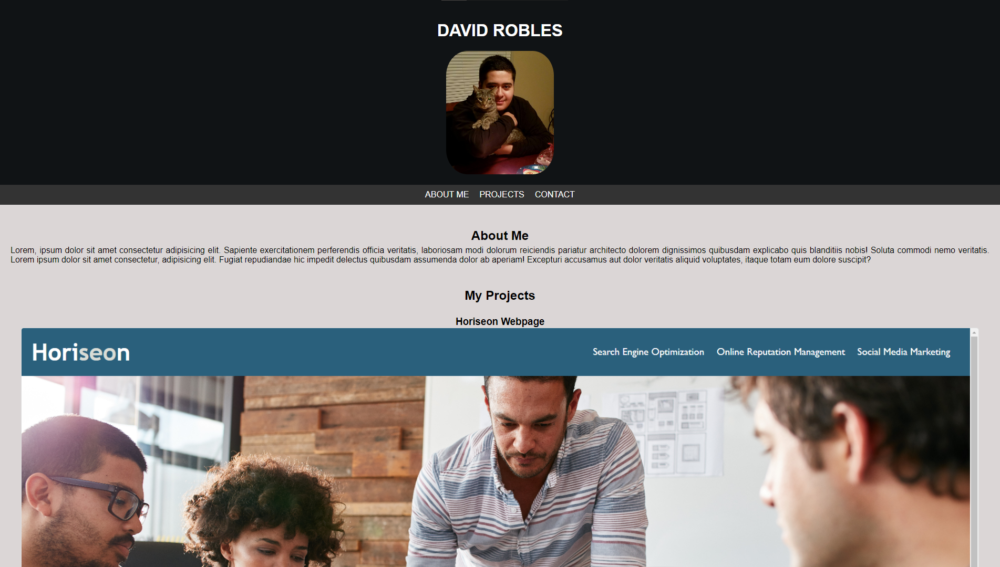
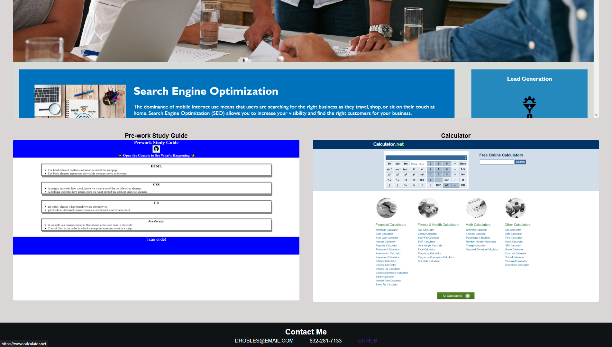

# My Portfolio!

#### This Week's Bootcamp Even-Number Challenge: 
Our assignment for Week Two is to create a webpage using what we've learned about HTML and CSS.

## Link To Website
[Click here to be re-directed!](https://callbeyond.github.io/MyPorfolio/ "Click here to visit Horiseon!")

## Usage
Right click the website and inspect the HTML and CSS code! 

## Screenshots

## Credits

UofM-VIRT-FSF-PT-10-2023-U-LOLC-ENTG
## License

[MIT](https://choosealicense.com/licenses/mit/)

